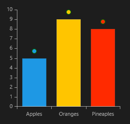

# Label Strategy

When you want to fully customize the labels of your chart, you can use Label Strategy to override the labels' appearance, content and layout.

## Properties

In order to use Label Strategy you have to greate a class inheriting the **ChartSeriesLabelStrategy**
class and specify the **LabelStrategyOptions** you wish to customize, and override their corresponding methods.

Here are listed all LabelStrategyOptions:

* **DefaultVisual**: The strategy will provide a custom visual element for each label. You have to override the **CreateDefaultVisual** method.

* **Measure**: The strategy will provide custom measurement logic for each label. You have to override the **GetLabelDesiredSize** method.

* **Content**: The strategy will provide custom content for each label. You have to override the **GetLabelContent** method. You can also override the **SetLabelContent** method used for UI virtualization and allows to reuse label content when panning and zooming.

* **Arrange**: The strategy will provide custom arrange logic for each label. You have to override the **GetLabelLayoutSlot** method.

For example:

	public LabelStrategyOptions options = LabelStrategyOptions.DefaultVisual | LabelStrategyOptions.Measure;

Or you can assign all values:

	public LabelStrategyOptions options = LabelStrategyOptions.All;

## Example

> You can use the [Bar Series]() article to see how to create a chart with bar series.

Here is the custom label strategy:

	public class BarLabelStrategy : ChartSeriesLabelStrategy
	{
	    private readonly LabelStrategyOptions options = LabelStrategyOptions.DefaultVisual | LabelStrategyOptions.Measure;
	
	    public override LabelStrategyOptions Options
	    {
	        get
	        {
	            return this.options;
	        }
	    }
	
	    public override FrameworkElement CreateDefaultVisual(DataPoint point, int labelIndex)
	    {
	        var series = point.Presenter as ChartSeries;
	        
	        return new Ellipse()
	        {
	            Stroke = new SolidColorBrush(Colors.Green),
	            Fill = series.Chart.Palette.GetBrush(point.CollectionIndex, PaletteVisualPart.Fill)
	        };
	    }
	
	    public override RadSize GetLabelDesiredSize(DataPoint point, FrameworkElement visual, int labelIndex)
	    {
	        return new RadSize(10, 10);
	    }
	}

>If you use elements that do not have desired size you have to override the **GetLabelDesiredSize** method.

Here is how you can use the strategy with your Bar Series: 

	<chart:BarSeries.LabelDefinitions>
	    <chart:ChartSeriesLabelDefinition HorizontalAlignment="Center" Margin="0,0,0,10" >
	        <chart:ChartSeriesLabelDefinition.Strategy>
	            <local:BarLabelStrategy/>
	        </chart:ChartSeriesLabelDefinition.Strategy>
	    </chart:ChartSeriesLabelDefinition>
	</chart:BarSeries.LabelDefinitions>

Where:

	xmlns:chart="using:Telerik.UI.Xaml.Controls.Chart"

Here is the result:

