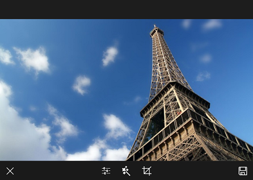

# Getting Started

This quick start tutorial will help you setup and add a ImageEditor control to an application.

First, you need to add reference to the following Telerik assemblies:

* **Telerik.Core.dll**
* **Telerik.UI.Xaml.Primitives.dll**
* **Telerik.UI.Xaml.Input.dll**

Alternatively, you can add a reference to **Telerik UI for {{ site.framework_name }} SDK**.

If you wish to use our [set of predefined tools]() you have to add the [Lumia Imaging SDK 2.0](https://msdn.microsoft.com/en-us/library/dn859593.aspx) (you can do this via **NUGet** package manager) and the following assembly that provides integration with the Lumia Imaging SDK which is CPU architecture dependent:

* **Telerik.UI.Xaml.Controls.Input.ImageEditor.Tools.dll**

You are ready to add the **RadImageEditor** to your project. Here is the XAML definition:

	<input:RadImageEditor x:Name="imageEditor">
	    <tools:ImageEditorBasicGroup/>
	    <tools:ImageEditorEffectsGroup/>
	    <tools:ImageEditorTransformGroup/>
	</input:RadImageEditor>

Where:

	xmlns:imageEditor="using:Telerik.UI.Xaml.Controls.Input.ImageEditor"
	xmlns:input="using:Telerik.UI.Xaml.Controls.Input"
	xmlns:tools="using:Telerik.UI.Xaml.Controls.Input.ImageEditor.Tools"

And here is how you can set the image source:

	private async void LoadImage()
	{
	    var folder = await Package.Current.InstalledLocation.GetFolderAsync("Images");
	    var imageFile = await folder.GetFileAsync("Eiffel-Tower.jpg");
	    this.imageEditor.Source = imageFile;
	}

This is the result:

