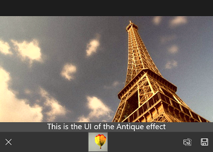
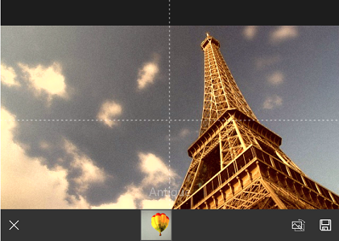

# Tools

RadImageEditor tools apply a specific effect to the image. Each tool can have immediate effect, or it cam be more complex and its settings can be controled with the tool UI or the tool layer. The RadImageEditor supports a large number of tools that are listed below.

## Tool Groups

The tools are organized in [tool groups](). Each group has a **Name** and an **Icon** property and can contain a number of tools. There are three predefined tool groups:

- **ImageEditorBasicGroup**
 - BrightnessTool
 - ContrastTool
 - HueTool
 - SaturationTool
 - SharpnessTool
 - TemperatureTool
 - VibranceTool
- **ImageEditorEffectsGroup**
 - NoEffectTool
 - AntiqueTool
 - GrayscaleTool
 - LomoTool
 - MoonlightTool
 - NegativeTool
 - PosterizeTool
 - SepiaTool
- **ImageEditorTransformGroup**
 - RotateLeftTool
 - RotateRightTool
 - VerticalFlipTool
 - HorizontalFlipTool
 - CropTool

Here is an example: 

	<input:RadImageEditor>
	    <tools:ImageEditorBasicGroup/>
	    <tools:ImageEditorEffectsGroup/>
	    <tools:ImageEditorTransformGroup/>
	</input:RadImageEditor>

You can also define your own groups:

	<input:RadImageEditor>
	    <imageEditor:ImageEditorToolGroup Icon="ms-appx:///Icons/effects-tool.png" Name="Effects">
	        <tools:SepiaTool/>
	        <tools:GrayscaleTool/> 
	    </imageEditor:ImageEditorToolGroup>
	    <imageEditor:ImageEditorToolGroup Icon="ms-appx:///Icons/transform-tool.png" Name="Transform">
	        <tools:HorizontalFlipTool/>
	        <tools:VerticalFlipTool/>
	    </imageEditor:ImageEditorToolGroup>
	</input:RadImageEditor>

## Custom Tools

You can also create your own tools. Here are the abstract classes that could be used as a base for all image editor tools:

* **ImageEditorTool**: The most basic tool type.
* **RangeTool**: The effect of these tools can vary in the predefined range of values. The UI provides a way to specify the magnitude of the effect.
* **ImageEditorTransformTool**: Allows the user to physically transform the image with gestures.
* **ImageEditorEffectTool**: These tools do not support any configuration, they directly apply an effect by selecting the tool.

> There are some specifics in the application of the different types of tools. Generally, the tool effect is applied when another tool is selected. The effect tools are exception - if an effect is selected, any previously selected effect in the same tool group will be discarded.

## Customization

### Custom UI

Each tool can support custom UI that appears above the tools list. For example the UI of the range tools is a [slider](). You can modify the UI with the **RadListView.ToolFactory** property.

Here is an example of how to add a custom UI to the AntiqueTool. You have to create a class that inherits from the **ImageEditorToolFactory** and override the **GetTemplate** method.

	public class CustomToolFactory : ImageEditorToolFactory
	{
	    public DataTemplate AntiqueTemplate { get; set; }
	
	    public override DataTemplate GetTemplate(ImageEditorTool tool)
	    {
	        if (tool != null && tool.Name == "Antique")
	        {
	            return this.AntiqueTemplate;
	        }
	
	        return null;
	    }
	}

Then you can set an instance of this class to the RadImageEditor.ToolFactory property.

	<input:RadImageEditor>
		<imageEditor:ImageEditorToolGroup Icon="ms-appx:///Images/effects-tool.png">
		    <tools:AntiqueTool/>
		</imageEditor:ImageEditorToolGroup>
		<input:RadImageEditor.ToolFactory>
		    <local:CustomToolFactory>
		        <local:CustomToolFactory.AntiqueTemplate>
		            <DataTemplate>
		                <TextBlock Text="This is the UI of the Antique effect" HorizontalAlignment="Center" VerticalAlignment="Center" FontSize="26" />
		            </DataTemplate>
		        </local:CustomToolFactory.AntiqueTemplate>
		    </local:CustomToolFactory>
		</input:RadImageEditor.ToolFactory>
	</input:RadImageEditor>

Here is the result:

### Custom Tool Layer

Some tools require a custom layer that is drawn on top of the image. For example the CropTool has a layer with a rectangle that specifies the crop area. You can add a custom layers with the **RadImageEditor.LayerSelector** property.

Here is an example of how to add a custom layer to the AntiqueTool.

Here is the custom layer that will be added on top of the image. It inherits from the **ImageEditorLayer** class.

	public class CustomLayer : ImageEditorLayer
	{
	    private FrameworkElement visual;
	    private Line hLine;
	    private Line vLine;
	
	    public CustomLayer()
	    {
	        var grid = new Grid();
	        var brush = new SolidColorBrush(Colors.White);
	
	        hLine = new Line { HorizontalAlignment = HorizontalAlignment.Stretch, Stroke = brush, StrokeThickness = 1, StrokeDashArray = new DoubleCollection { 4, 5 } };
	        vLine = new Line { VerticalAlignment = VerticalAlignment.Stretch, Stroke = brush, StrokeThickness = 1, StrokeDashArray = new DoubleCollection { 4, 5 } };
	
	        grid.Children.Add(hLine);
	        grid.Children.Add(vLine);
	
	        this.visual = grid;
	    }
	
	    protected override FrameworkElement VisualElement { get { return this.visual; } }
	
	    public override void ArrangeLayer(Telerik.Core.RadSize availableSize)
	    {
	        hLine.X2 = Owner.ActualWidth;
	        hLine.Y1 = hLine.Y2 = Owner.ActualHeight / 2;
	
	        vLine.X1 = vLine.X2 = Owner.ActualWidth / 2;
	        vLine.Y2 = Owner.ActualHeight;
	
	        base.ArrangeLayer(availableSize);
	    }	
	}

Then we have to create a layer selector class and override the **SelectLayer** method:

	public class LayerSelector : ImageEditorLayerSelector
	{
	    public override ImageEditorLayer SelectLayer(ImageEditorTool currentTool)
	    {
	        if (currentTool != null && currentTool.Name == "Antique")
	        {
	            return new CustomLayer();
	        }
	
	        return base.SelectLayer(currentTool);
	    }
	}

Finally, set the **RadImageEditor.LayerSelector** property to an instance of the created layer selector class:

	<input:RadImageEditor x:Name="imageEditor">
	    <imageEditor:ImageEditorToolGroup Icon="ms-appx:///Images/effects-tool.png">
	        <tools:AntiqueTool/>
	    </imageEditor:ImageEditorToolGroup>
	    <input:RadImageEditor.LayerSelector>
	        <local:LayerSelector />
	    </input:RadImageEditor.LayerSelector>
	</input:RadImageEditor>

Here is the result:

