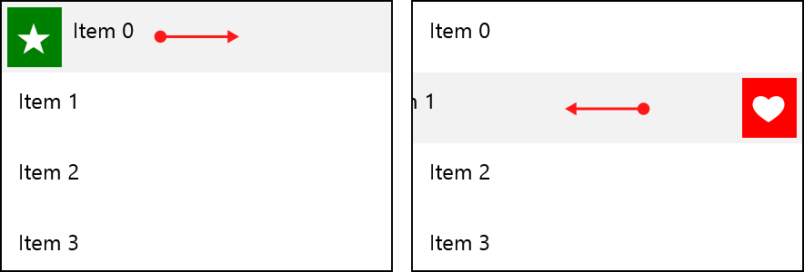

# Gestures

The RadListView control provides support for item drag gestures. Depending on how the user interacts with the control, two different behaviors are available:

- **Reordering**: There are two reorder modes:
	- With hold gesture: Enabled by first holding on an item until the reorder mode is triggered and then you are allowed to drag and drop the item at the desired position.
	- With reorder handle: Enabled by dragging the item reorder handle.
- **Swiping**: Swiping left or right over the **swipe area** (see the image below) displays the **SwipeActionContent**.

## Swiping

The RadListViewcontrol exposes the following properties related to item swiping:

- **IsActionOnSwipeEnabled** (bool): Enables the item swiping.
- **SwipeActionContent** (object): Gets or sets the content below the swiped item.
- **ItemSwipeThreshold** (double): When an item is released after swipe, this threshold defines whether the item will remain swiped at the ItemSwipeOffset position or it will return to its normal state.
- **ItemSwipeOffset** (Thickness): Sets the offset of the item if the swiping is successful.

Example:

	<telerikData:RadListView ItemsSource="{Binding}" IsActionOnSwipeEnabled="True" SelectionMode="None" ItemSwipeOffset="50">
	    <telerikData:RadListView.SwipeActionContent>
	        <Grid>
	            <Grid.ColumnDefinitions>
	                <ColumnDefinition Width="50"/>
	                <ColumnDefinition Width="*"/>
	                <ColumnDefinition Width="50"/>
	            </Grid.ColumnDefinitions>
	            <Border Background="Green">
	                <TextBlock Text="&#xE0B4;" FontFamily="Segoe UI Symbol" HorizontalAlignment="Center" VerticalAlignment="Center" FontSize="30" Foreground="White"/>
	            </Border>
	            <Border Background="Red" Grid.Column="2">
	                <TextBlock Text="&#xE0A5;" FontFamily="Segoe UI Symbol" HorizontalAlignment="Center" VerticalAlignment="Center" FontSize="30" Foreground="White"/>
	            </Border>
	        </Grid>
	    </telerikData:RadListView.SwipeActionContent>
	</telerikData:RadListView>

## Reordering

- **IsItemReorderEnabled** (bool): Enabled the reordering.
- **ReorderMode** (ListViewReorderMode): Gets or sets the reorder mode.
	- *Default*: The reordering starts with holding on the item. 
	- *Handle*: The reordering starts when the item is dragged using the reorder handle. The handle is visible only in this mode. 
 
Example:
	
	<telerikData:RadListView ItemsSource="{Binding}" ReorderMode="Handle" IsItemReorderEnabled="True"/>

## Commands

The RadListView control provides number of commands that are executed when a certain gesture occurs:

- **ItemDragStartingCommand**: Executed when the user starts dragging an item.  
  The command parameter is of type **ItemDragStartingContext** and provides the following properties:
	- **Item** (object): The interaction item.
	- **Action** (DragAction): Specifies whether the action is related to reordering or swiping. The available values are { *Reorder*, *ItemAction* }.
- **ItemDragCompleteCommand**: Executed when the item is released.  
  The command parameter is of type **ItemDragCompleteContext** and provides the following properties:
	- **Item** (object): The interaction item.
	- **Action** (DragAction): Specifies whether the action is related to reordering or swiping. The available values are { *Reorder*, *ItemAction* }.
	- **DragDelta** (double): The distance that the item has traveled. 
	- **DestinationItem** (object): When the Action is *Reorder*, this is the item that is shifted by the dragged item.
- **ItemActionTapCommand**: Executed when the SwipeActionButton is tapped.  
  The command parameter is of type **ItemActionTapContext** and provides the following properties:
	- **Item** (object): The interaction item.
	- **Offset** (double): The current offset of the item.
- **ItemSwipingCommand**: Executed while item is being swiped.  
  The command parameter is of type **ItemSwipingContext** and provides the following properties:
	- **Item** (object): The interaction item.
	- **DragDelta** (double): The distance that the item has traveled. 
- **ItemSwipeActionCompleteCommand**: Executed when the swiping of the item has finished.  
  The command parameter is of type **ItemSwipeActionCompleteContext** and provides the following properties:
	- **Item** (object): The interaction item.
	- **FinalDragOffset** (double): The final drag offset that the item will be positioned.
	- **DragDelta** (double): The distance that the item has traveled.

>You can find more information about the RadListView commands [here]().

## Methods

- **EndItemDrag**(): Ends all drag currently running operations.

## How to Implement Reorder Functionality

The RadListView does not automatically reorder the items in its ItemsSource, but you can use the ItemDragCompleteCommand to do this.

Here is the XAML definition of the RadListView. The view model class should be defined as a static resource.
 
	<Page.Resources>
	    <local:ViewModel x:Key="viewModel"/>
	</Page.Resources>

	<telerikDataControls:RadListView DataContext="{StaticResource viewModel}" ItemsSource="{Binding Items}" IsItemReorderEnabled="True">
	     <telerikDataControls:RadListView.ItemTemplate>
	        <DataTemplate>
	            <TextBlock Text="{Binding Text}"/>
	        </DataTemplate>
	    </telerikDataControls:RadListView.ItemTemplate>
	    <telerikDataControls:RadListView.Commands>
	        <telerikListViewCommands:ListViewUserCommand Id="ItemDragComplete" Command="{Binding ReorderItemsCommand, Source={StaticResource viewModel}}"/>
	    </telerikDataControls:RadListView.Commands>
	</telerikDataControls:RadListView>
		
Where:

    xmlns:telerikDataControls="using:Telerik.UI.Xaml.Controls.Data"
    xmlns:telerikListViewCommands="using:Telerik.UI.Xaml.Controls.Data.ListView.Commands"

Here are the view model and data classes:

	public class ViewModel
	{
	    public ViewModel()
	    {
	        this.Items = GetItems();
	        this.ReorderItemsCommand = new DelegateCommand(ReorderItems);
	    }
	
	    public ICommand ReorderItemsCommand { get; set; }
	
	    public ObservableCollection<Item> Items { get; set; }
	
	    private ObservableCollection<Item> GetItems()
	    {
	        var items = new ObservableCollection<Item>();
	        for (var i = 0; i < 3; i++)
	        {
	            items.Add(new Item { Text = "item " + i });
	        }
	
	        return items;
	    }
	
	    private void ReorderItems(object parameter)
	    {
	        var context = parameter as ItemDragCompleteContext;
	
	        if (context.Action == DragAction.Reorder)
	        {
	            var item = context.Item as Item;
	            var destItem = context.DestinationItem as Item;
	
	            int sourceIndex = this.Items.IndexOf(item);
	            int targetIndex = this.Items.IndexOf(destItem);
	
	            this.Items.Move(sourceIndex, targetIndex);
	        }
	    }
	}

	public class Item
	{
	    public string Text { get; set; }
	}
